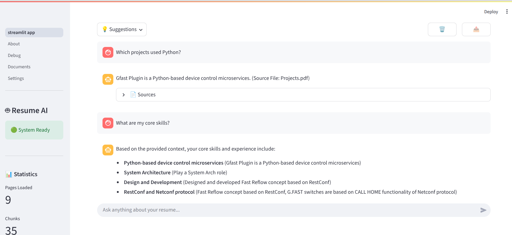
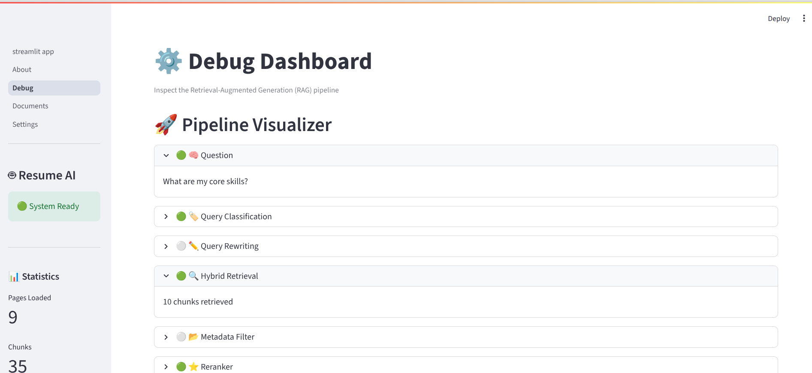
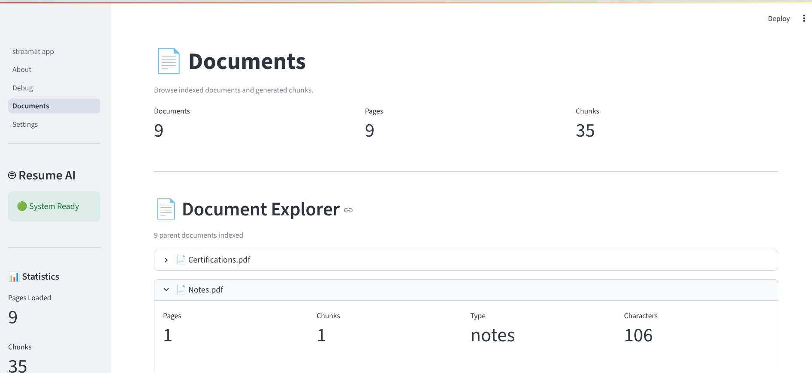
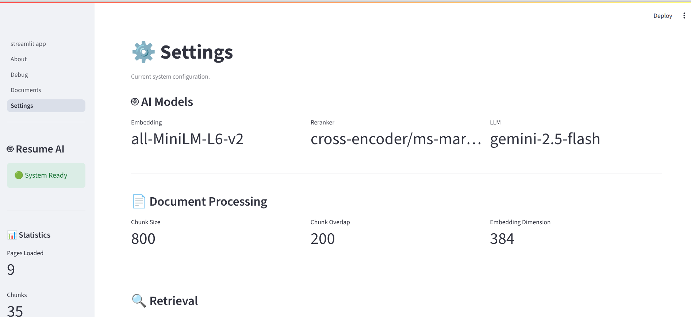
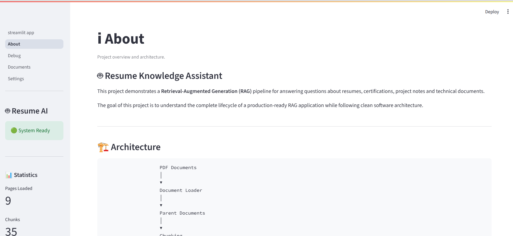
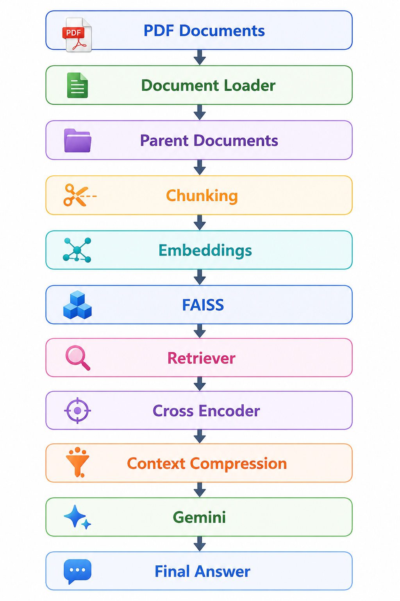
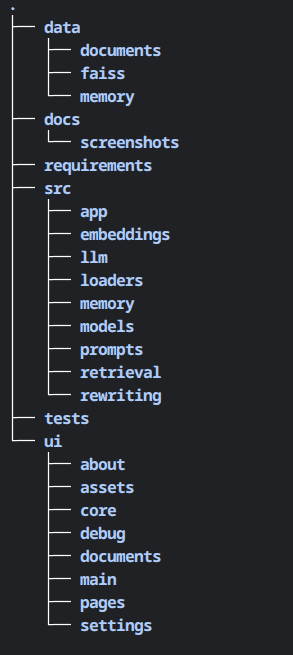

# 🤖 Resume Knowledge Assistant

An AI-powered **Retrieval-Augmented Generation (RAG)** application that answers questions from resumes, certifications, project documents and technical notes using semantic search and Google Gemini.

---

## Features

- Semantic Search using FAISS
- Parent Document Retrieval
- Context Compression
- Cross Encoder Re-ranking
- Conversation Memory
- Streamlit Dashboard
- Retrieval Debugger
- Document Explorer
- Modular Architecture

---

## Screenshots

### Main Page



---

### Debug Dashboard



---

### Documents



---

### Settings



---

### About



---

## Project Architecture



---

## Project Structure



---

## Technology Stack

| Component | Technology |
|------------|------------|
| Language | Python 3.13 |
| UI | Streamlit |
| LLM | Google Gemini 2.5 Flash |
| Embeddings | all-MiniLM-L6-v2 |
| Re-ranking | Cross Encoder |
| Vector DB | FAISS |
| PDF Parsing | PyPDF |
| Testing | Custom Test Framework |

---

## Installation

```bash
git clone https://github.com/pacificpatel165/AI_Systems_Architect_Lab.git

cd Project_01_Resume_Knowledge_Assistant

pip install -r requirements/base.txt requirements/cpu.txt requirements/dev.txt

## Run CLI
python main.py

## Run Streamlit
streamlit run ui/streamlit_app.py

## Run FastAPI
uvicorn src.api.app:app --reload

## Display FastAPI 
http://127.0.0.1:8000/docs#/

## Run Tests
python main.py --test all
```
